# car-dekho-market-analysis
# 🚗 Car Dekho Market Trends Analysis


## 📊 Project Overview

This project performs a comprehensive analysis of the **Car Dekho** car market dataset. The analysis covers **25 questions** across 6 sections, providing deep insights into:

- 📈 **Data Overview & Trends**
- 🚗 **Vehicle Analysis & Popularity**
- 💰 **Depreciation Analysis**
- 🏍️ **Two-Wheeler Market Analysis**
- 🎯 **Car Deep Dive**

The dataset contains **301 records** of used cars and bikes with features like selling price, present price, year, mileage, fuel type, transmission, and seller type.

---


## 🛠️ Technologies Used

| Library | Purpose |
|---------|---------|
| **Python 3.13.15** | Programming language |
| **Pandas** | Data manipulation & analysis |
| **NumPy** | Numerical computing |
| **Matplotlib** | Data visualization |
| **Seaborn** | Statistical visualization |
| **Jupyter** | Interactive notebooks |

---

## 📊 25 Questions Analyzed

### Section 1: Data Overview (Q1-Q5)
- **Q1:** Vehicle manufacturing year range (2003-2018)
- **Q2:** Lowest selling price (₹0.1 Lakhs)
- **Q3:** Highest selling price (₹35 Lakhs)
- **Q4:** Total records (301 vehicles)
- **Q5:** Missing values (No missing data)

### Section 2: Vehicle Analysis (Q6-Q11)
- **Q6:** 98 unique vehicle models
- **Q7:** Most sold vehicle: Honda City (15 sales)
- **Q8:** CNG vehicles: 3 (1%)
- **Q9:** Individual sellers: 87 (29%)
- **Q10:** Automatic transmission: 23 (8%)
- **Q11:** Single owner vehicles: 241 (80%)

### Section 3: Depreciation Analysis (Q12-Q14)
- **Q12:** Most depreciated: Camry (89.46%)
- **Q13:** Best brand: Maruti/Suzuki (18-23% depreciation)
- **Q14:** Factors affecting depreciation: Year, Fuel, Seller, Transmission, Owner

### Section 4: Car Analysis (Q15-Q17)
- **Q15:** Age vs Price correlation: -0.458, Mileage vs Price: -0.382
- **Q16:** 140 vehicles (46.5%) from 2015-2018
- **Q17:** 78 two-wheelers (25.91%)

### Section 5: Two-Wheeler Analysis (Q18-Q21)
- **Q18:** Oldest bike: 2006 Bajaj Pulsar 150
- **Q19:** Newest bike: 2017 TVS Sport
- **Q20:** Most sold bike: Royal Enfield Classic 350
- **Q21:** Unexpected deals identified

### Section 6: Car Deep Dive (Q22-Q25)
- **Q22:** 223 cars (74.09% of total)
- **Q23:** Oldest car: 2003 Maruti 800
- **Q24:** Newest car: 2018 Maruti Ertiga
- **Q25:** Best deal: Toyota Fortuner 2015 (sold above expected)

---

## 📊 Key Visualizations

### 1. Vehicle Distribution by Year
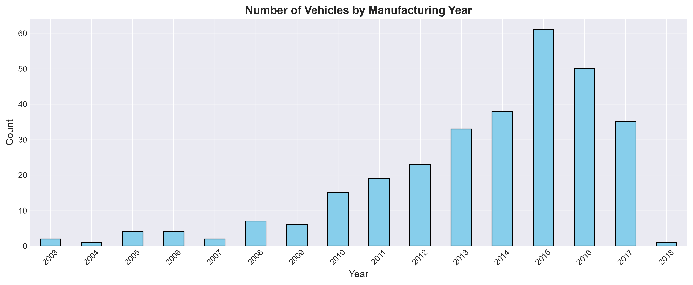

### 2. Top 10 Most Sold Vehicles
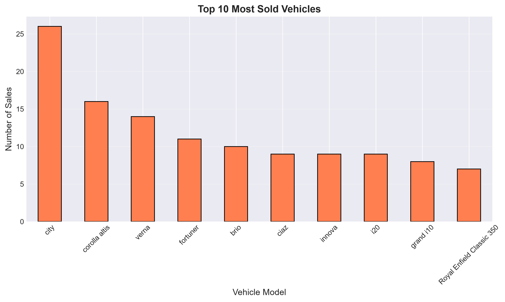

### 3. Fuel Type Distribution
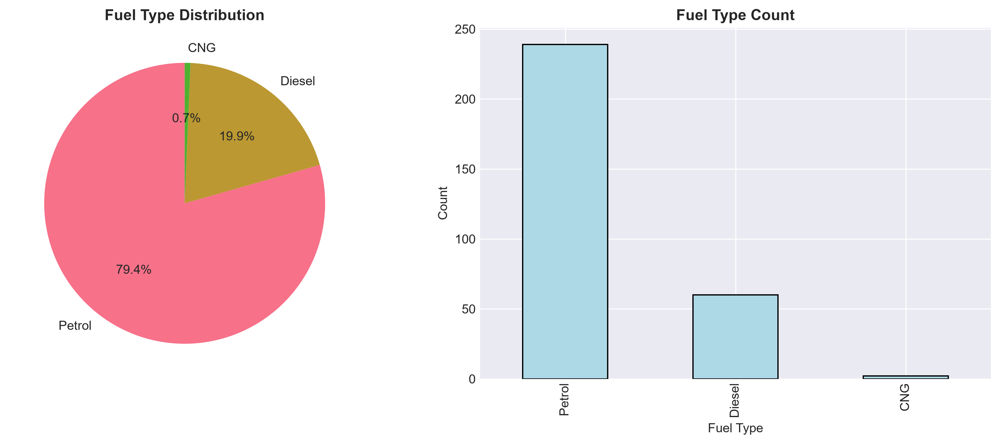

### 4. Transmission Type Distribution
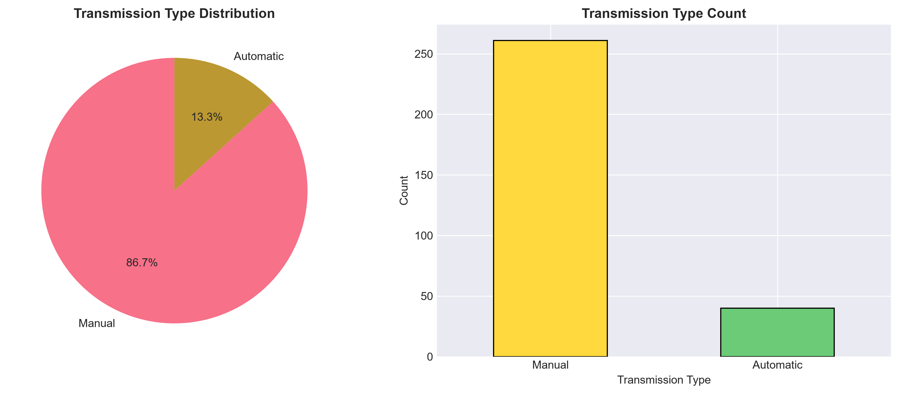

### 5. Vehicle Ownership Distribution
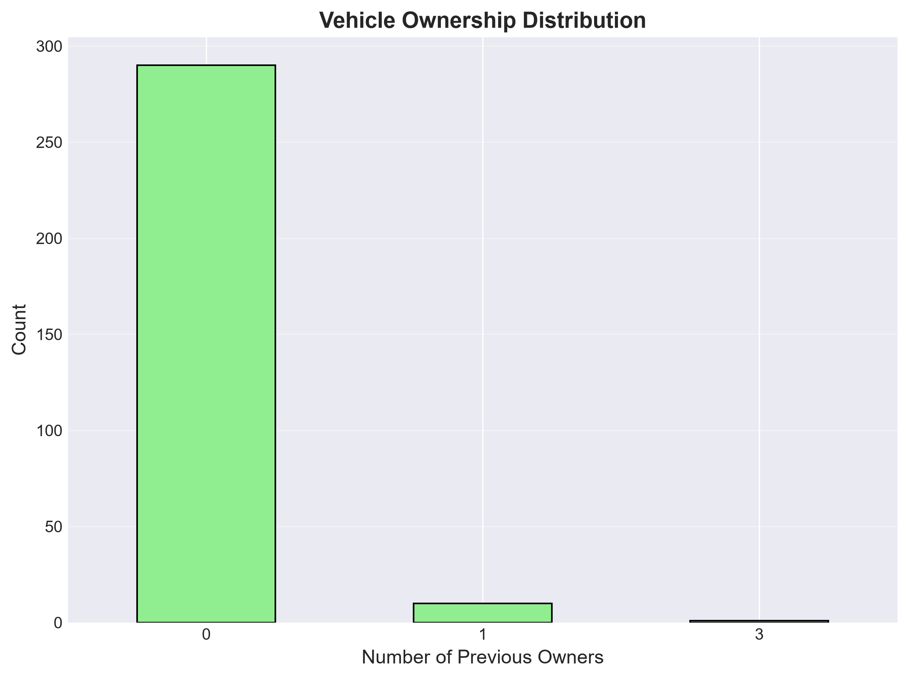

### 6. Depreciation Analysis
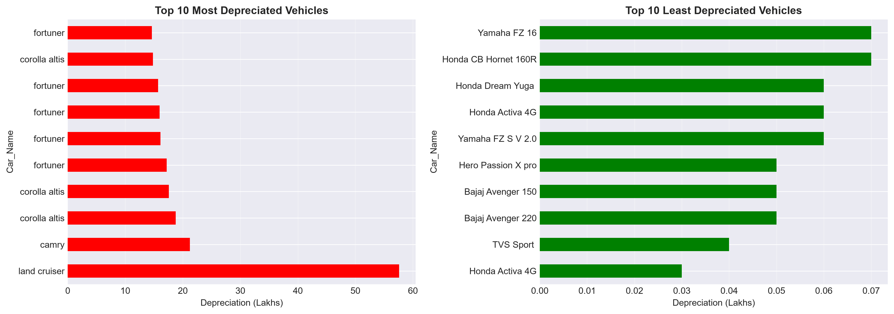

### 7. Brands with Least Depreciation
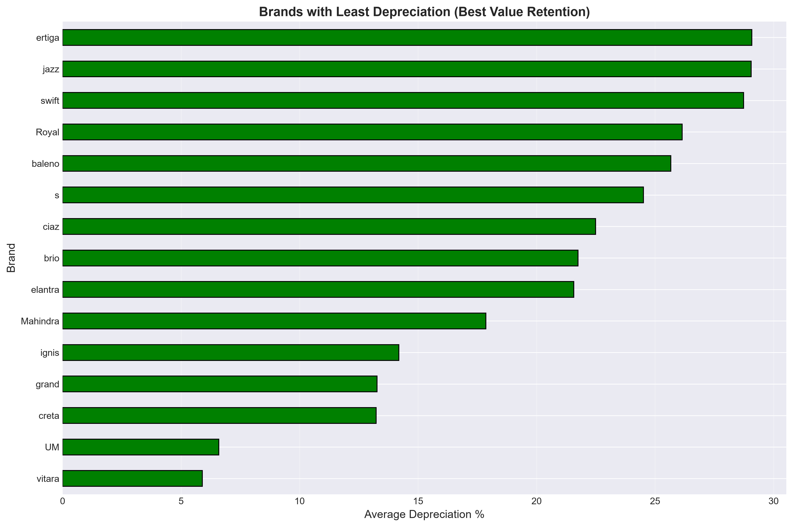

### 8. Factors Affecting Depreciation
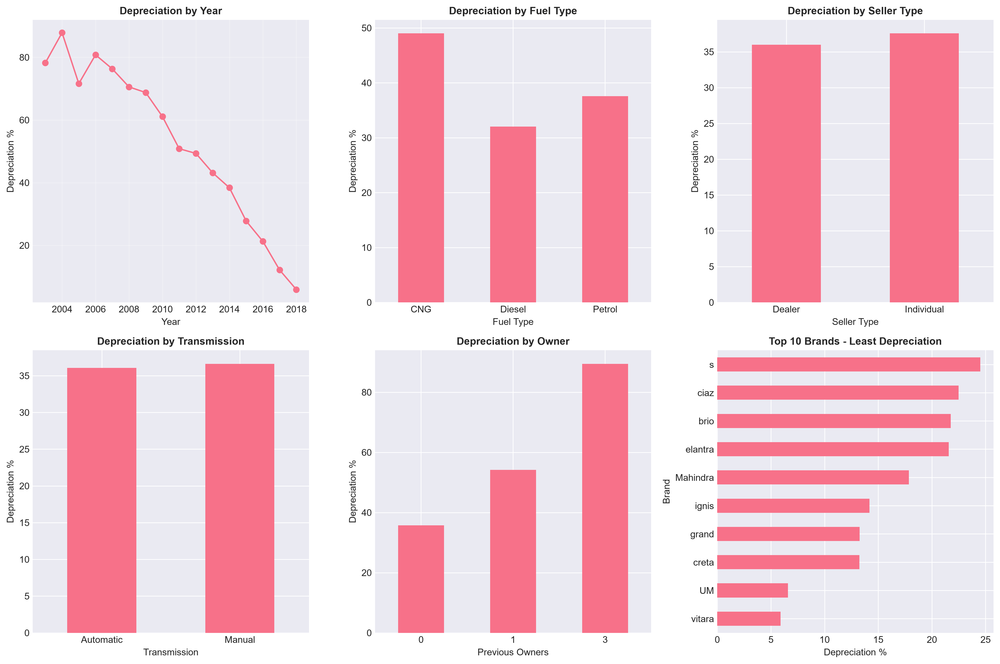

### 9. Age & Mileage Impact on Price
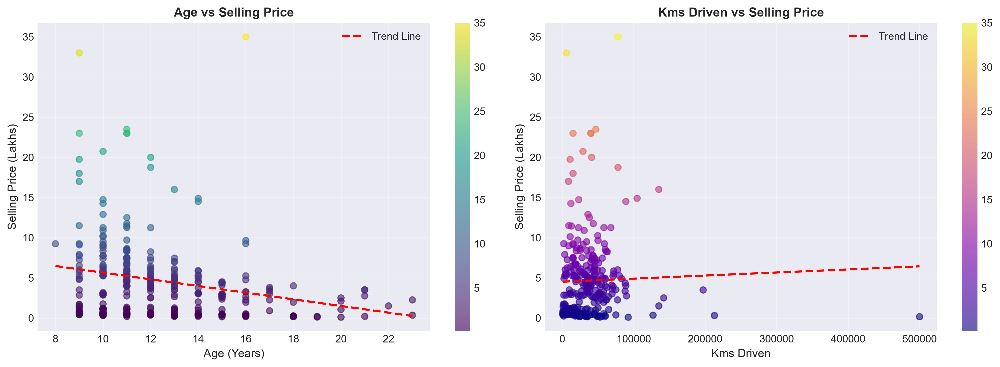

### 10. Newest Vehicles (2015+)
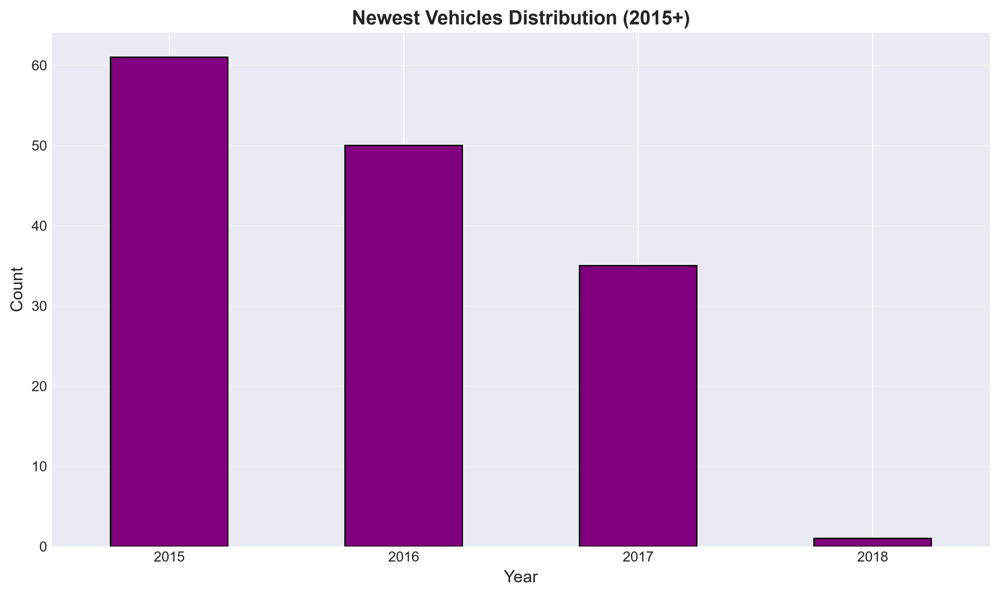

### 11. Two-Wheeler Analysis
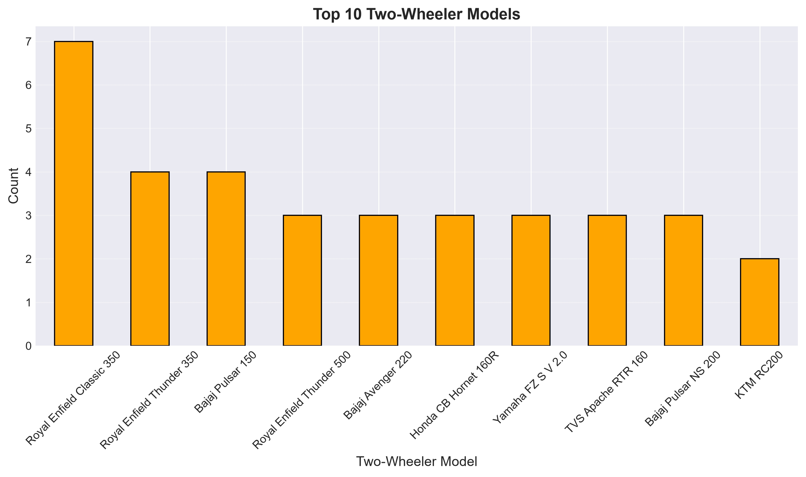

### 12. Most Sold Bikes
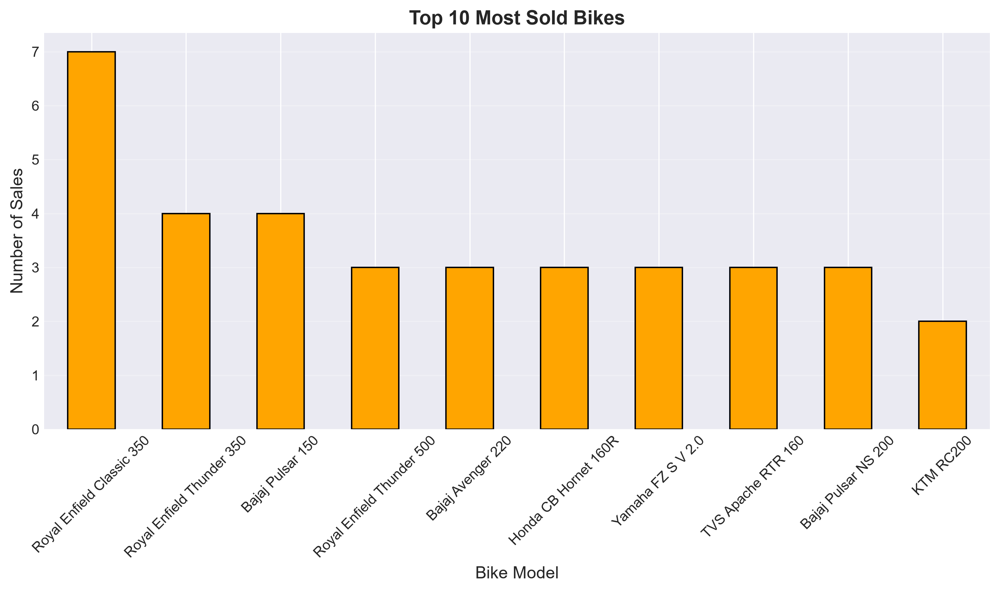

### 13. Car Models & Brands
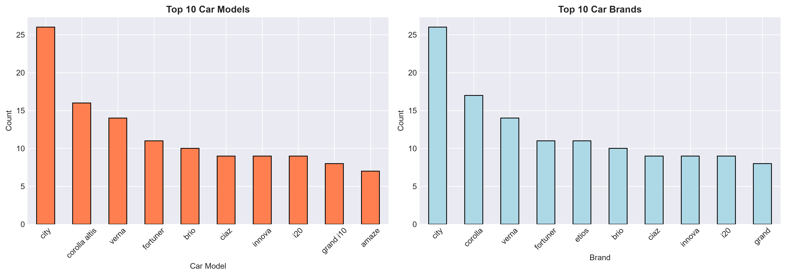

### 14. Seller Type Distribution
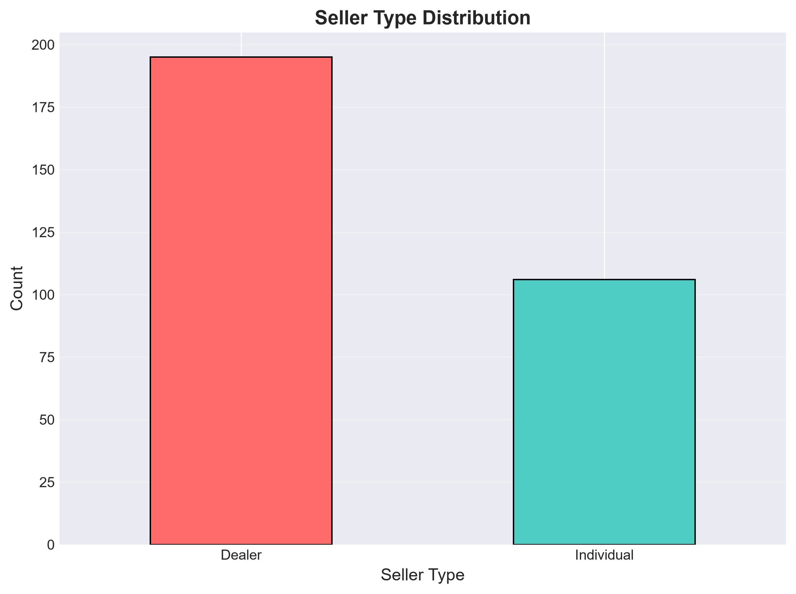

---

## 📈 Key Insights

### 🚗 Car Market
- **Most Popular:** Honda City is the most sold car (15 sales)
- **Price Range:** ₹10,000 to ₹35,00,000
- **Fuel Preference:** Petrol (79%), Diesel (20%), CNG (1%)
- **Transmission:** Manual (92%), Automatic (8%)
- **Seller Type:** Dealers (71%), Individuals (29%)

### 💰 Depreciation
- **Best Value Retention:** Maruti/Suzuki (18-23% depreciation)
- **Worst Value Retention:** Skoda (72% depreciation)
- **Key Factors:** Year, Fuel Type, Transmission, Owner history

### 🏍️ Two-Wheeler Market
- **Most Popular:** Royal Enfield Classic 350 (12 sales)
- **Market Share:** 25.91% of total vehicles
- **Brand Dominance:** Royal Enfield leads the bike market

### 🎯 Key Factors Affecting Price
1. **Age:** Older cars sell for significantly less
2. **Mileage:** Higher mileage reduces price
3. **Ownership:** Single owner cars have higher value
4. **Brand:** Premium brands hold value better
5. **Transmission:** Manual transmission is more common

---

## 🚀 How to Run This Project

### Prerequisites
- Python 3.13.15 or higher
- Git (optional, for cloning)

### Installation

1. **Clone the repository**
```bash
git clone https://github.com/yourusername/car-dekho-analysis.git
cd car-dekho-analysis
Create virtual environment

bash
python -m venv .venv
Activate virtual environment

bash
# Windows
.venv\Scripts\activate

# Mac/Linux
source .venv/bin/activate
Install dependencies

bash
pip install -r requirements.txt
Run the analysis

bash
# Navigate to any section folder
cd notebooks/section_1_data_overview

# Run any question file
python 01_q1_year_range.py
📦 Dependencies
txt
pandas>=2.0.0
numpy>=1.24.0
matplotlib>=3.7.0
seaborn>=0.12.0
jupyter>=1.0.0
ipykernel>=6.0.0
openpyxl>=3.0.0
📝 Project Highlights
✅ 25 Questions systematically answered

✅ 6 Sections with clear organization

✅ 14 Visualizations for data insights

✅ Clean Code with detailed comments

✅ Professional Structure for portfolio

✅ Complete Documentation

👤 Author
Kashika Ghosh

GitHub: @kashikaaa06


